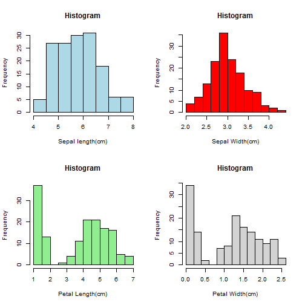

Course Project for Developing Data Products
========================================================
author: Chao Liu
date: 2016-05-24

Overview
========================================================

This is the presentation slides for course project for developing data products.The slides will cover the following things:  

- Introduction to Dataset and Variables
- Explantory Histograms
- Predicting Algorithm  

Roughly speaking, this Shiny app is using the machine learning algorithm to predict the species variable in Iris dataset by the sepal and petal length and width. 

Introduction to Dataset and Variables
========================================================

The dataset we will use is from the build-in dataset of R:

```r
data(iris)
```
  
This famous (Fisher's or Anderson's) iris data set gives the measurements in centimeters of the variables sepal length and width and petal length and width, respectively, for 50 flowers from each of 3 species of iris. The species are Iris setosa, versicolor, and virginica.

Explantory Histograms
========================================================

Before we develop the prediction algorithm, we will first see the histogram to get a rough idea about how the sepal and petal distributed. In R, we can did this by:


From the histograms, we can see the distributions of sepal and petal of these three flowers.

Predicting Algorithm (Machine Learning)
====
The algorithm used here is the combination of random forest and gradient bagging model. We combine them together to get more accuracy. We use 70% of the original data of iris as the training set and 30% of it as the testing set. Ultimately, we get **100%** accurate on the testing set. Hence, we should feel confidence about the predicting algorithm.  
We put the code in the last slides to conclude our presentation.

Code for our algorithm
===

```r
library(caret)
inTrain <- createDataPartition(iris$Species, p = 0.7, list = FALSE)
training <- iris[inTrain, ]
testing <- iris[-inTrain, ]
ctrol <- trainControl(method = "cv", number = 5)
mod1 <- train(Species ~ ., data = training, trControl = ctrol, method = "rf")
mod2 <- train(Species ~ ., data = training, trControl = ctrol, method = "gbm", verbose = FALSE)
mod <- list(mod1, mod2)
pred_train <- lapply(mod, function(model) predict(model, training))
names(pred_train) <- c("model1","model2") 
pred_train$Species <- training$Species
Stack_data <- as.data.frame(pred_train)
comod <- train(Species ~ ., data = Stack_data, method = "rf",trControl = ctrol)

res <- function(Sepal.Length,Sepal.Width,Petal.Length,Petal.Width){
    dat <- list(Sepal.Length = Sepal.Length, Sepal.Width = Sepal.Width,
                Petal.Length=Petal.Length,Petal.Width=Petal.Width)
    dat <- as.data.frame(dat)
    pred_dat <- lapply(mod, function(model) predict(model, dat))
    names(pred_dat) <- c("model1","model2") 
    Stack_data_dat <- as.data.frame(pred_dat)
    as.character(predict(comod, Stack_data_dat))
}
```
